# Decision Data Governance for Enterprise Agents: Mermaid Diagrams

This document turns the product logic from `agent-readiness-governance.en.md` into Mermaid diagrams covering the core problem, system architecture, specialized agents, Evidence Quality, MVP flow, deliverables, and guardrails.

## 1. Core Judgment

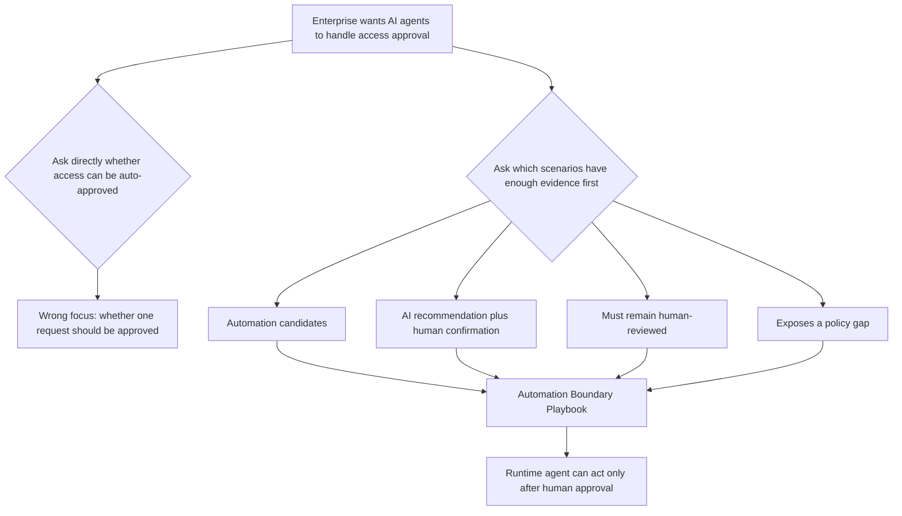

## 2. Product Positioning

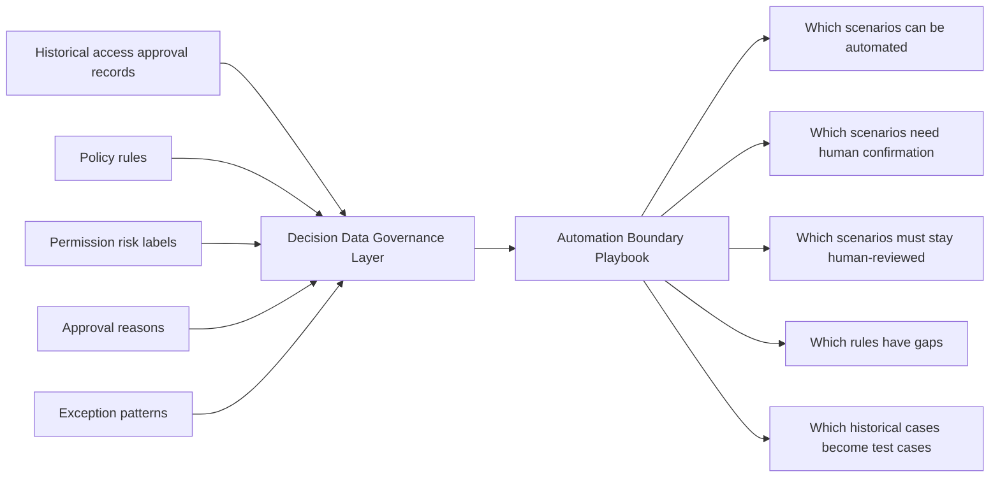

## 3. Agent-Native Architecture

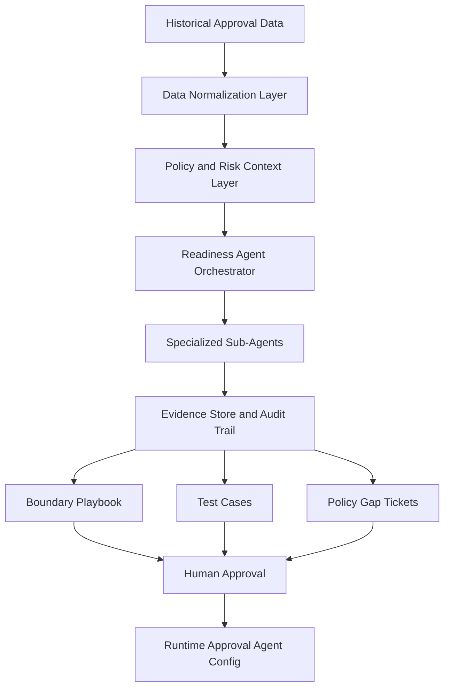

## 4. Three Governance Planes

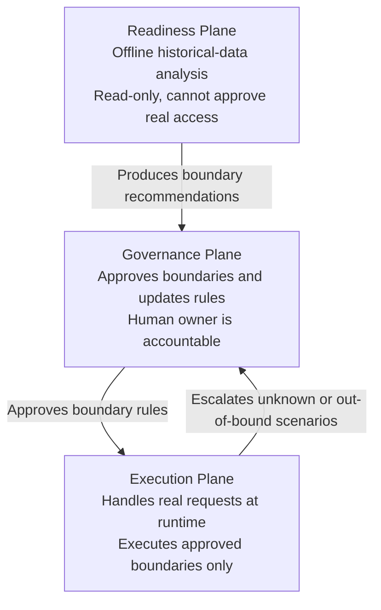

## 5. Specialized Agents

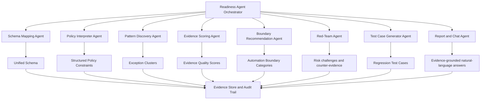

## 6. Evidence Quality Mechanism

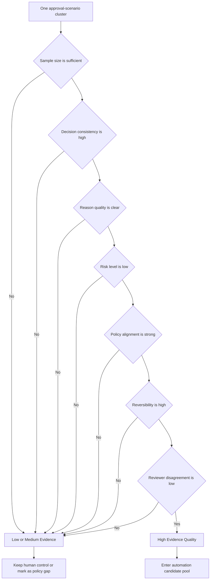

## 7. Decision Classification Rules

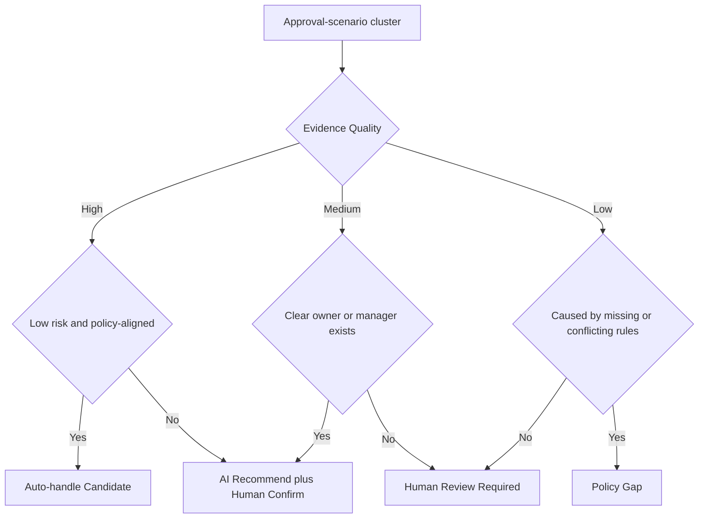

## 8. MVP Demo Flow

```mermaid
flowchart LR
  A["Upload historical approval CSV"] --> B["Generate exception clusters"]
  B --> C["Show Evidence Quality for each cluster"]
  C --> D["Produce automation recommendations"]
  D --> E["Generate Boundary Playbook"]
  E --> F["Generate test cases"]
  F --> G["Generate policy gap tickets"]
  G --> H["User asks natural-language questions"]
  H --> I["Answers must cite the Evidence Store"]
```

## 9. Input Fields To Governance Output

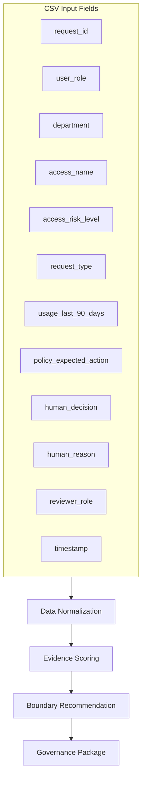

## 10. Final Governance Package

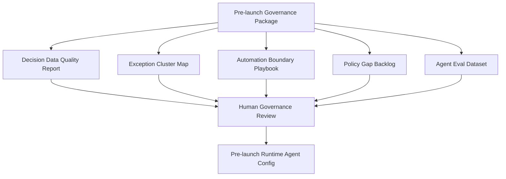

## 11. Example Cluster Classification

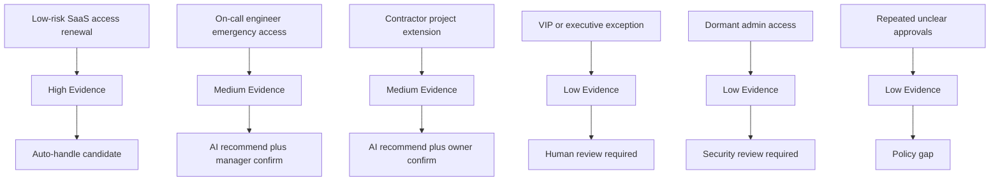

## 12. Risks And Guardrails

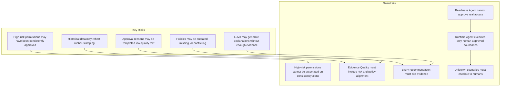

## 13. Final Narrative

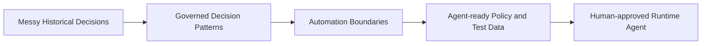
