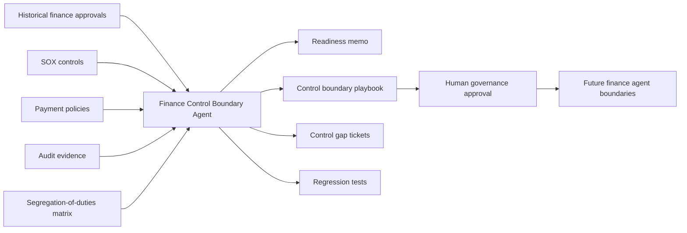
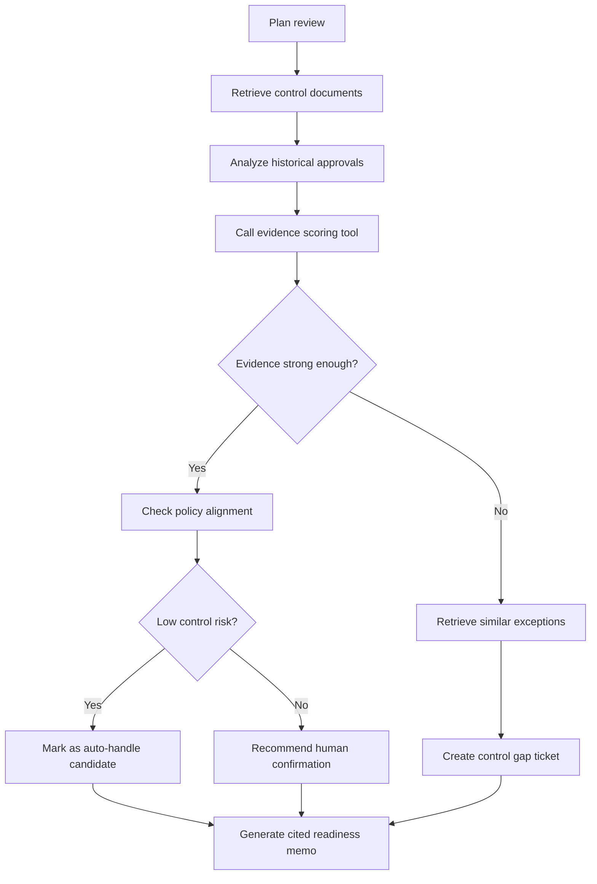

# Finance Agent Control Boundary

## One-Line Pitch

We built a document-grounded finance governance agent that determines which recurring finance decisions are safe for future agents to automate, using historical approvals, SOX controls, payment policies, and audit evidence.

## Problem

Finance teams want agents to reduce repetitive work in vendor payments, expense approvals, month-end operations, payroll exceptions, and finance-system access reviews.

But finance decisions are controlled decisions. A high historical approval rate does not mean a workflow is safe to automate. It may reflect rubber-stamping, missing audit evidence, unclear policy, or weak segregation-of-duties controls.

## Product

The Finance Agent Control Boundary is a read-only readiness agent.

It does not approve payments, release funds, or grant access. It reviews historical finance decisions and control documents, then produces safe operating boundaries for future finance agents.

## Core Outputs

- Finance Agent Readiness Memo
- Control Boundary Playbook
- SOX Evidence Quality Report
- Finance Exception Cluster Map
- Control Gap Tickets
- Regression Tests for Finance Agent Launch

## Example Decisions

| Finance pattern | Agent recommendation |
| --- | --- |
| Recurring low-value vendor invoice | Auto-handle candidate after AP owner approval |
| Standard expense reimbursement | AI recommend + manager confirm |
| New vendor payment | Controller review required |
| Payroll admin exception | Human review required |
| Executive override | Audit review required |
| Missing invoice attachment | Control gap ticket |

## Architecture

## Agent Workflow

## Why It Matters

Enterprises should not give finance agents decision power just because past humans usually clicked approve.

This agent answers a safer question:

> Which finance decision patterns have enough policy evidence, audit quality, and control consistency to become agent-ready?
