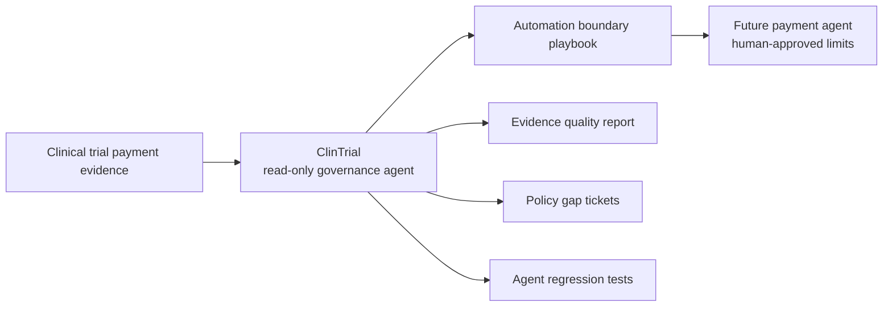
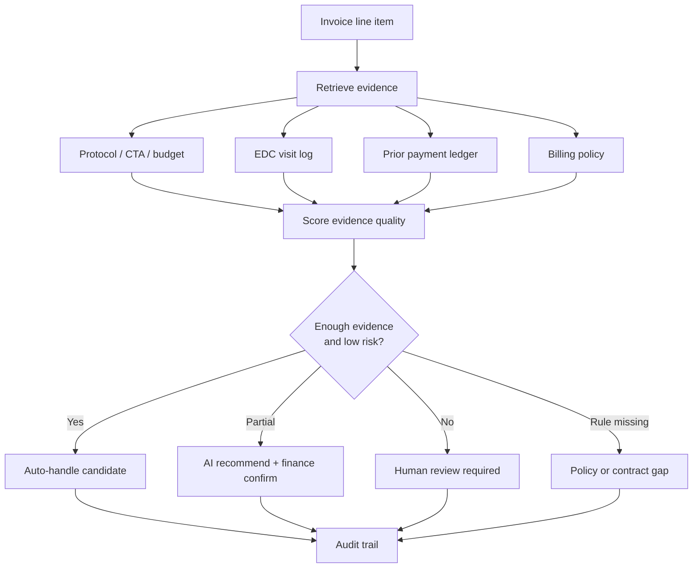
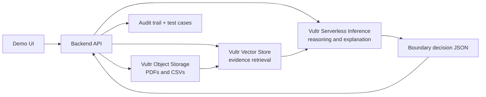

# ClinTrial Core Workflows

## 1. Product Core

```mermaid
flowchart LR
  A["Clinical trial payment evidence"] --> B["ClinTrial<br/>read-only governance agent"]
  B --> C["Automation boundary playbook"]
  B --> D["Evidence quality report"]
  B --> E["Policy gap tickets"]
  B --> F["Agent regression tests"]

  C --> G["Future payment agent<br/>human-approved limits"]
```

## 2. Main Decision Workflow

```mermaid
flowchart TD
  A["Invoice line item"] --> B["Retrieve evidence"]
  B --> C["Protocol / CTA / budget"]
  B --> D["EDC visit log"]
  B --> E["Prior payment ledger"]
  B --> F["Billing policy"]

  C --> G["Score evidence quality"]
  D --> G
  E --> G
  F --> G

  G --> H{"Enough evidence<br/>and low risk?"}
  H -- "Yes" --> I["Auto-handle candidate"]
  H -- "Partial" --> J["AI recommend + finance confirm"]
  H -- "No" --> K["Human review required"]
  H -- "Rule missing" --> L["Policy or contract gap"]

  I --> M["Audit trail"]
  J --> M
  K --> M
  L --> M
```

## 3. Vultr MVP Architecture

```mermaid
flowchart LR
  A["Demo UI"] --> B["Backend API"]

  B --> C["Vultr Object Storage<br/>PDFs and CSVs"]
  B --> D["Vultr Vector Store<br/>evidence retrieval"]
  B --> E["Vultr Serverless Inference<br/>reasoning and explanation"]

  C --> D
  D --> E
  E --> F["Boundary decision JSON"]
  F --> B
  B --> G["Audit trail + test cases"]
```

